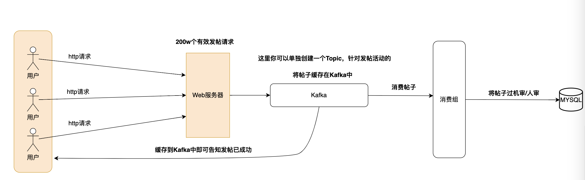

# Golang实现异步队列


源代码已托管至Github: https://github.com/gofish2020/easyqueue


## 为什么需要异步队列？

在高并发系统中，如果同时有大量的请求/任务需要进行处理，由于系统的负载能力有限，一次性能够同时处理的请求/任务是有限的。那么这些任务就需要进行排队，先来的先处理，后来的后处理。如果超过了整个队列能够容纳的请求/任务，那么后续的请求/任务直接拒绝掉（丢弃），保证整个业务系统的正常运行。


**举个例子**：比如我们要做一个秒杀的项目，有个商品数量只有300个，但是同一时刻，有300w个用户来抢商品。对于系统来说，我们需要这300w个用户同时进入到数据库中抢商品吗？肯定是不现实的，数据库是会承受不了的（呀咩爹）。
因为只有300个商品，理论上我们只需要让300个（不同的）用户进来，剩下的299.9700w个用户直接拒绝掉即可。
将这300个用户处理完以后，可能商品还有剩余（比如有人退款了），抢购肯定是一直有人在抢，那么继续再来300个用户，继续抢购剩下的商品，直到商品全部被抢购完。

这里的300只是个比喻，比如你有500个商品，每次让100个用户来抢，每抢完一批，再放100用户进来，直到商品抢完（或抢购到期自动结束）。


我们一般的`http`请求，来300w个请求就会直接处理300w请求，并不能做到让请求阻塞排队，并异步处理的效果。所以，需要设计一个队列，让请求阻塞，并通过异步处理的方式处理`http`请求，这样我们就可以控制同时读写数据库的请求数量，不至于把数据库打崩。


## 逻辑架构

整个的模型就是【生产者】【消费者】模型。
*这种模型真的好通用，如果看过之前的`EasyRedis`系列，里面的很多设计都是类似的。*


队列数量和worker数量都是可配置的

## 测试Demo
用gin框架演示异步处理`http`请求：

说明：这里的测试demo只是单机版的，所以库存放在本地。
如果是实际的业务系统（会启动多个http服务器）每个请求会负载到不同的web服务器上处，库存信息是要放到`Redis or Mysql`中，那就需要分布式锁保证扣减库存不会存在超卖问题。

```go
package main

import (
	"net/http"
	"strconv"
	"sync/atomic"
	"time"

	"github.com/gin-gonic/gin"
	"github.com/gofish2020/easyqueue"
)

// 创建队列（1个队列，容量 100，消费协程 1个）
var g_Queue = easyqueue.CreateEasyQueue(easyqueue.SetQueueParttion(1), easyqueue.SetQueueCapacity(100), easyqueue.SetWorkerNum(1))

var cacheNum atomic.Int64
var errCount atomic.Int64
var sucessCount atomic.Int64
var selloutCount atomic.Int64

var pingCount atomic.Int64

func main() {

	// 20个库存的商品
	cacheNum.Store(20)

	r := gin.Default()

	// 结果统计
	r.GET("/cache", func(c *gin.Context) {

		c.JSON(http.StatusOK, gin.H{
			"商品剩余数量":      strconv.Itoa(int(cacheNum.Load())),
			"售罄->没买到的用户":  strconv.Itoa(int(selloutCount.Load())),
			"队列满->丢弃的用户数": strconv.Itoa(int(errCount.Load())),
			"成功->抢购的用户数":  strconv.Itoa(int(sucessCount.Load())),
			"抢购链接->总调用次数": strconv.Itoa(int(pingCount.Load())),
		})
	})

	// 增加商品库存
	r.GET("/add", func(c *gin.Context) {
		cacheNum.Add(20)

		c.JSON(http.StatusOK, gin.H{
			"message": "success",
		})
	})

	// 秒杀商品
	r.GET("/ping", func(c *gin.Context) {

		pingCount.Add(1)

		// 如果已经售罄直接返回
		if cacheNum.Load() == 0 {
			selloutCount.Add(1)
			c.JSON(http.StatusOK, gin.H{
				"message": "商品售罄",
			})

			return
		}

		// 进入队列
		waitJob := g_Queue.Push(func() {

			// 写http请求中自己的业务逻辑....

			//1. 先判断是否售罄
			if cacheNum.Load() == 0 {
				selloutCount.Add(1)
				c.JSON(http.StatusOK, gin.H{
					"message": "商品售罄",
				})
			} else { //2.未售罄

				// 3.扣减库存
				cacheNum.Add(-1)
				// 4.下单逻辑..(模拟业务有点慢)
				time.Sleep(500 * time.Millisecond)
				// 5.告诉客户抢购成功
				sucessCount.Add(1)
				c.JSON(http.StatusOK, gin.H{
					"message": "抢购成功",
				})
			}

		})

		// 阻塞等待
		<-waitJob.Done()

		// 如果阻塞返回，err不为nil，说明上面的队列任务没有执行，这里做补偿逻辑
		if waitJob.Err() == easyqueue.ErrOverFlow { // 表示进入队列失败（队列满了)
			errCount.Add(1)
			c.JSON(http.StatusOK, gin.H{
				"message": "抢购人数过多，请重试...",
			})
		}
	})
	r.Run()
}


```


**ab压测命令：**


`ab`是一个压测工具，`MacOS`系统自带该工具，你可以本地直接`ab -V`查看是否存在。


-c 表示并发请求数，这里是100（如果想更大的并发请求数，需要调高操作系统的文件句柄数，不然ab工具会报错 too many files）
-n 表示总共发送多少请求，这里是1w

`ab -c 100 -n 10000 http://127.0.0.1:8080/ping` 

然后浏览器访问 `http://127.0.0.1:8080/cache`查看秒杀统计结果


你也可以继续调用`http://127.0.0.1:8080/add`增加库存，继续重复上面的【秒杀 + 查看秒杀结果】

## 代码逻辑概述


`EasyQueue`结构体，是对 `queue  Queue`和`wg     *workerGroup`的一个额外的包装（目的让使用的时候更方便），本身唯一的一个函数`Push`也是调用的队列`eq.queue.Push(job)`的`Push`方法。
所以，只需要看 `createMultiJobQueue`和 `createWorkerMange`方法即可。
```go
type EasyQueue struct {
	config Config       // 配置
	queue  Queue        // 队列
	wg     *workerGroup // 消费组
}

func (eq *EasyQueue) Push(fn func()) WaitJob {
	job := newJob(fn)
	eq.queue.Push(job)
	return job
}

func CreateEasyQueue(cfs ...configFunc) *EasyQueue {

	conf := Config{}
	for _, cf := range cfs {
		cf(&conf)
	}

	eq := EasyQueue{
		config: conf,
	}

	eq.queue = createMultiJobQueue(conf.QueuePartition, conf.QueueCapacity)
	eq.wg = createWorkerMange(eq.queue, conf.WorkersNum)

	return &eq
}

```

## createMultiJobQueue

该函数本质就是初始化一个切片`queues   []*jobQueue`。基于配置的队列个数，创建`partition`个队列`createJobQueue(queueCapacity)`，每个队列有个容量。所以，总容量就是【队列个数 * 单个队列的容量】

`Push`方法基于自增id对队列个数取模，将`job`按照轮询的方式放入队列中。保证队列数据的负载均衡

```go
// 多队列
type multiJobQueue struct {
	queues   []*jobQueue
	parition int

	pushIdx *idGenerator
	popIdx  *idGenerator
}

// partition * perCap = All Capacity
func createMultiJobQueue(partition, queueCapacity int) *multiJobQueue {

	if partition < 1 {
		panic("partition must bigger than 0")
	}

	multi := &multiJobQueue{
		parition: partition,
		pushIdx:  newIDGenerator(),
		popIdx:   newIDGenerator(),
	}

	for i := 0; i < partition; i++ {
		multi.queues = append(multi.queues, createJobQueue(queueCapacity))
	}
	return multi
}

// 按照 Round-Robin的方式选择队列，并放入任务
func (mjq *multiJobQueue) Push(jb JobInterface) {
	mjq.queues[mjq.pushIdx.Next()%uint64(mjq.parition)].Push(jb)
}

```


## createWorkerMange

基于配置的工作协程数量，创建`workerNum`个工作协程`createWorker`并启动`worker.Run()`消费逻辑。将所有的协程都保存到切片`workers    []*worker`中


`Adjust`目的想动态的调整工作协程的数量，加锁（避免竞态）修改切片`workers    []*worker`。

停止协程只需调用`wm.workers[i].Stop()`方法给协程打个标记，协程会自动停止。

```go

// 消费组
type workerGroup struct {
	mu         sync.Mutex
	workers    []*worker
	workersNum int
	queue      Queue
}

func createWorkerMange(queue Queue, workerNum int) *workerGroup {
	mange := workerGroup{
		workersNum: workerNum,
		queue:      queue,
	}
	for i := 0; i < workerNum; i++ {
		worker := createWorker(queue)
		worker.Run()
		mange.workers = append(mange.workers, worker)
	}
	return &mange
}


// 动态调整消费者的数量
func (wm *workerGroup) Adjust(workerNum int) {
	if workerNum == wm.workersNum {
		return // do nothing
	}

	wm.mu.Lock()
	defer wm.mu.Unlock()

	if workerNum > wm.workersNum { // 增加
		for i := wm.workersNum; i < workerNum; i++ {
			worker := createWorker(wm.queue)
			worker.Run()
			wm.workers = append(wm.workers, worker)
		}

	} else { // 减少
		for i := workerNum; i < wm.workersNum; i++ {
			wm.workers[i].Stop()
		}
		wm.workers = wm.workers[:wm.workersNum-workerNum]
	}

	wm.workersNum = workerNum
}
```


## 消费逻辑

队列和工作组都创建完成后，只需要看`func (w *worker) Run()`方法即可知道协程是怎么消费的。
本质就是调用队列的`w.queue.PopTimeout`方法，弹出任务然后执行任务`job.DoJob()`

这里之所以调用带超时时间的。因为如果本协程消费的队列中一直没有任务，那么本协程会一直阻塞不返回，但是其他队列中可能有任务，本协程因为阻塞在队列上，是不可能去消费其他队列的。那就会出现假死的现象。
所以，我们需要在本队列没有任务的时候，延迟一会放弃本队列，然后通过Round-Robin的策略选择下一个队列去消费。

```go

type worker struct {
	queue  Queue        // 工作协程监视的队列
	closed atomic.Int32 // 是否停止工作协程标识
}

func createWorker(queue Queue) *worker {
	return &worker{
		queue:  queue,
		closed: atomic.Int32{},
	}
}

func (w *worker) Run() {

	w.closed.Store(0)
	go func() {
		for {

			if w.closed.Load() > 0 { // 关闭worker
				break
			}

			job := w.queue.PopTimeout(1 * time.Millisecond)
			//job := w.queue.Pop()
			if job != nil {
				job.DoJob()
			}
		}
	}()
}

func (w *worker) Stop() {
	w.closed.Store(1)
}

```


## 扩展思考
上面的这种方案是针对请求是可以丢弃的。如果你做的系统比如微博/论坛类型，有个发帖功能，做了一个活动，发帖有奖金，那么可能会有300w个人同时在线发帖，那么这些http请求都是有效的请求，一般情况下我们是不能丢弃的。在高并发系统中，我们可以做限流，比如用户5s内只能发1篇帖子。但是对个人限流完以后，可能还会存在200w的有效请求，此时我们可以这么做（如下图），也是通过异步的方式（解耦）。
如果采用同步的方式保存到数据库中：
- 数据库有可能写入非常的慢（CPU/IO会很高）
- 数据写入以后，我们可能还需要做调用审核（第三方的审核可能会很慢）

都需要耗费大量的时间，对用户的体验就不好，会感觉系统很卡顿。

